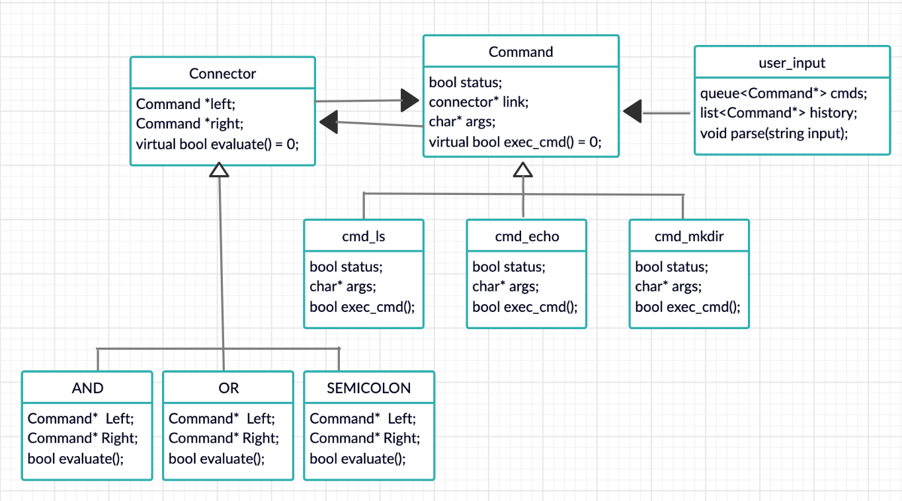

# CS 100 Programming Project
---
# Project Info
# R'Shell made with <3 in C++
### By Anthony Hallak (862072917) & Brian Coffey (862062098) for CS100 in Fall 2019
Assignment 1 Development Update - 10/30/19
---
# Introduction
* This program will (hopefully) be able to act as a simple shell to take in input, parse it, and run the appropriate commands.
We will use the Composite and Strategy Design Pattern to create `Command` objects that get parsed from user input. From user input, we put that into a `stringstream`, from that we read out each string (since it handles whitespace for us) we then construct each `Command` object if it matches `'ls', 'echo', or 'mkdir'`. After identifying the command, we read in any options, ie if the user wrote `'ls -a'` we read in `'ls'` and add `'-a'` as an extra parameter to the `Command` object. The connectors are treated as a special type of 'command' a command that has two `Command` object references, a left and right, and executes them based on the condition of the connector. For example, if we see a `&&` we construct the `Command` objects for both the left and right side and then create a `Connector` object that has a reference to both that then evaulates the left and if it succeeds, then it will evaluate the right side.
---
# Diagram

 
---
# Classes
* `user_input` class that holds a queue<Commands*> and a List<Commands*> that saves a list of already run commands
* `Command`'s class that holds a status code for if it finished successfully or failed, as well as a `char*` of arguments for the user options 
    * `cmd_ls` class that holds arguments to run `/bin/ls` with its `char*` of arguments
    * `cmd_echo` class that holds arguments to run `echo` since it is built into the shell
    * `cmd_mkdir` class that holds arguments to run `/bin/mkdir` with its `char*` of arguments
* `Connector` that takes in two commands and resolves the conditionals ('||' or '&&'), evaulates both if ';' is present 
---
# Prototypes/Research
* parsing 
	* we used `getline()` to read in the user input and then threw that into a stringstream constructor, then iterate over it using a while loop, if it matched `ls` then we used `fork()` to create a child, then `waitpid()` to have the child execute `ls` using `execvp()`. We did not account for connectors yet.

* `waitpid(), execvp(), fork()`
	* at first, we used the string from the stream to run `execvp()` but ran into problems, so we had to use `char*` to get around the errors. As for `waitpid()` and `fork()`, after reading the man pages, watching some youtube, and experimenting with different options, we were able to figure out how to use both functions. Thanks to stackoverflow for help on the `execvp()` part and some youtube videos on explaining how to use `fork()` and `waitpid()` [link here](https://www.youtube.com/watch?v=HDMkuDVuDyc)
	
* connectors
	* we did not account for connectors yet but have used the bash shell enough to use them and understand how they work (for the most part). We ran the connector examples in the assignment document and compared the outputs to what we expected to happen, this gave us an idea on how to approach the design of our program and how we should treat user input and parse it in a way that made the most sense when it came time for the program to execute the commands.
---
# Development and Testing Roadmap
* parser algorithm 
    * finalize, account for edge cases(empty, gibberish, comment(#), not existant command, multiple commands, complicated connector decomposition), test to see if recognizes all valid commands, once done testing move on
* command class 
    * write each command its own class to hold status and argument list and execute command function, test via parser to make sure parser can correctly take in user input and call the appropriate command class
* user_input class
    * queue route 
        * NOTES: easy implementation, but might not handle connectors very well
        * enqueue list of commands, use connectors as special commands that require the status of the previous command, write finished commands to history
---
# Assignment 2 Development Update - 11/13/19
* Parsing
	* We parsed the string using the boost tokenizer. It took a while to learn how to implement the tokenizer, but it's 	      really useful for trimming and dealing with the whitespace in the string.
* Composite Pattern
	* We ran into a lot of issues while trying to implement the composite pattern, so we resorted to just figuring out a 	       way to get the parser functioning. We will go back in assignment 3 and adjust the design of the program in order to 	     fit the composite pattern.
* Noteable Challenges
	* Errors were fairly difficult to fix in such a large program. Next time we are going to incrementally develop the 	     program extension and make sure it compiles. Coding large sections without compiling makes it difficult to find the 	   error(s). A lot of time was wasted due to this.
	* The boost tokenizer took a while to figure out since we've never used it before, but it's a great tool!
* Milestones
	* compiles
	* single executables work i.e. ls, cd
	* multiple commands work i.e. ls -la && echo Hello World
	* integration tests finished
	* unit test - parser passes 100% of 22 unique tests
	* added postfix implementation
---
# Assignment 3 Development Update - 11/27/19
* Parsing
	* Adjusted parser to account for parenthesis and brackets.
	* Parenthesis: All parenthesis outside of comments or echo strings must have a matching closing/opening parenthesis.
		* If parenthesis do not match, the parser stops and outputs an error and reprompts for the command.
	* Brackets: All bracket outside of comments or echo strings must have a matching closing/opening bracket.
* Noteable Challenges
	* Implemented R'Shell using the Composite pattern, postfix notation (also called Reverse Polish Notation), and a postfix tree.
	* Parser has been tweaked and is more efficient now. 
* Milestones
	* Connectors work consistently now (Including parenthesis).
	* Parenthesis work correctly and have been thoroughly tested with nested and non-nested parenthesis.
	* Test commands have been implemented.
	* Integration test bash script error fixed. It no longer hangs and gets trapped in R'Shell when executed.
	* Starting thorough debugging process and code revision.
	* 35 unique integration tests across 7 bash scripts
	* 40 unique parser tests across 3 test files
# Assignment 4 Development Update - 12/10/19
* Parsing
	* Adjusted parser to account for i/o redirection, appends, and pipes.
	* Appends and pipes need extra conditions in our parser because they use the same characters as connectors such as 'or' and 'output redirection.'
* Noteable Challenges
	* 4 new classes to handle i/o redirection, appends, and pipes.
	* Minor parser changes to handle specific connectors i.e. 'or' and 'output redirection.'
	* 4 new unit_test classes to test i/o redirection, appends, and pipes.
* Milestones
	* Adjust parser to handle all connectors appropriately.
	* Input and Output Redirection work now.
	* Append functions properly.
	* Pipe functions properly.
	* Integration tests all written and pass.
	* Unit tests for parser all written and pass.
	* Final assignment completed.